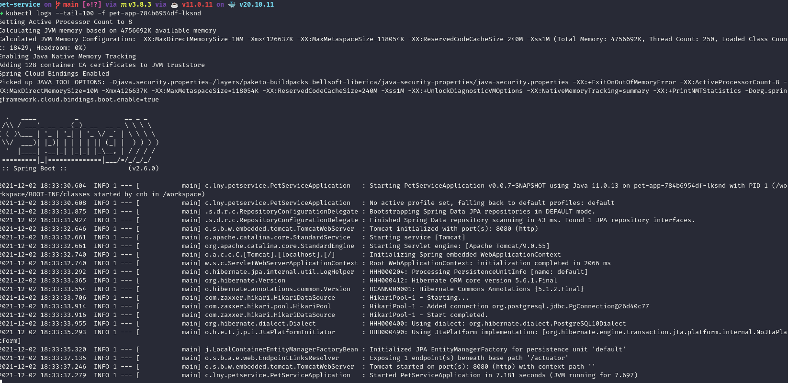

# Pet-Service

A project to study hexagonal architecture, some kubernetes features using a spring-boot application and postgres as a
write/read mode.

For this propose, it will be created a deployment with some pods and avoiding a lock database caused by the Liquibase
framework. It happens because liquibase inside the application start migrations tasks and the first one is lock our
database, in parallel others pods starts the same steps and could throw an exception or falling through the deployment
error.

Here the focus is on the architecture.

Look in the resource folder, all the migration files, fell free to create yours or modifying for tests.

## Tech Stack

**Built-in:**

* [Maven](https://maven.apache.org/)
* [Spring](https://spring.io/)
* [Liquibase](https://www.liquibase.com/)
* [SpringDoc-OpenApi](https://springdoc.org/)
* [Docker](https://www.docker.com/)
* [Kubernetes](https://kubernetes.io/)
* [K3D](https://k3d.io/stable/)

## Cloning the repo

```bash
git clone https://github.com/leoyassuda/pet-service.git
```

## Pre-requirements

You will need:

- Docker and Docker-Compose - To build and run the images
- K3D - It's a lightweight kubernetes to run locally
- JDK 11
- Maven 3

## Postgres Setup

This project is based on Docker and Kubernetes.

In `infra` folder exists all files to set up the development environment.

create a `.env.datasource` and `.env.pgadmin` files in infra folder. You can create following the example files `.env`
in `templates` folder.

For kubernetes, open `secret.yaml` and put your credentials replacing both string data values for the same value as you
config in `.env` files.

## Development

### Docker-Compose (Postgres)

There are two services commented:

- adminer
    - a simple visual client to access the database.
    - 
- pg_admin:
    - the power tool to admin Postgres Instances.
    - 
    - to login, depends on the `env.pgadmin` file.

Both are optional to use.

The `docker-compose` reference two folders `pg-main` and `pg-replica` they are used to building and configure the system
replication between databases.

> ⚠ **IMPORTANT** - Volume is used to replicate from master to replication using async wal config.

## Running

Compile the app

```bash
mvn clean install
```

build app image

```bash
mvn spring-boot:build-image -Dspring-boot.build-image.imageName=leoyassuda/pet-service
```

in parameter `imageName` set your image name.

Build liquibase image

In `infra` folder.

```bash
docker build -f liquibase.dockerfile -t leoyassuda/liquibase:latest ../
```

Start Postgres

```bash
docker-compose up
```

Create kubernetes secrets

Set values in `secret.yaml`

Execute command

```shell
kubectl create -f secret.yaml
```

Apply kubernetes deployment

> Check some values in `deployment-app.yaml`

Pay attention in Deployment at `spec.containers.image` the same image name that you built before

If you pushed the images to docker hub, may you need to set the context for kubernetes can pull images.

Other point to set value is the network, after docker-compose up with success. Find the gateway to set in your
deployment.

```shell
docker network inspect <network_name> 
```

Or with JQ installed previous

```shell
docker network inspect infra_bridge-petwork | jq '.[0].IPAM.Config[0].Gateway'
```

> shell print -> "172.26.0.1"

Login in terminal

```bash
docker login
```

Then pass (docker) context to kubernetes

```bash
kubectl create secret generic regcred \
    --from-file=.dockerconfigjson=<path/to/.docker/config.json> \
    --type=kubernetes.io/dockerconfigjson
```

Start the deployment

```bash
kubectl apply -f templates/deployment-app.yaml
```

To follow pods status

```bash
kubectl get pods -w
```


See logs

```bash
kubectl logs --tail=100 -f <podName>
```



To see liquibase logs

```bash
kubectl logs --tail=100 -f <podName> -c liquibase
```


Using a client, check the database:

- Before migration
    - 
- After migration
    - 

## API Document

TODO: Describe swagger documentation here

## Utils

Some util commands

#### create image using maven

mvn spring-boot:build-image -Dspring-boot.build-image.imageName=leoyassuda/pet-service

#### push image

```bash
docker push leoyassuda/pet-service
```

#### tail logs pod last 100 lines

```bash
kubectl logs --tail=100 -f <podName>
```

#### apply deployment kubernetes

```bash
kubectl apply -f templates/deployment-app.yaml
```

#### kube restart deployment

```bash
kubectl rollout restart deployment pet-app
```

#### build liquibase image

```bash
docker build -f liquibase.dockerfile -t liquibase:latest .
```

#### set scale

```bash
kubectl scale deployment/pet-app --replicas=0
```

#### create docker config auth

```bash
kubectl create secret generic regcred \
  --from-file=.dockerconfigjson=<path/to/.docker/config.json> \
  --type=kubernetes.io/dockerconfigjson
```

## References

* Jq reference to use with examples
  \- [JQ](https://www.linode.com/docs/guides/using-jq-to-process-json-on-the-command-line/)
* Liquibase/Kubernetes \- [Liquibase-Blog](https://www.liquibase.com/blog/using-liquibase-in-kubernetes)
* Multiple DataSources
  \- [Multi-DS](https://ehsaniara.medium.com/spring-boot-2-with-multiple-datasource-for-postgres-data-replication-182c89124f54)
* Hexagonal Arch \- [Hexagonal](https://reflectoring.io/spring-hexagonal/)

---

## Authors

- **Leo Yassuda** - _Initial work_ - [Portfolio](https://leoyas.com)
